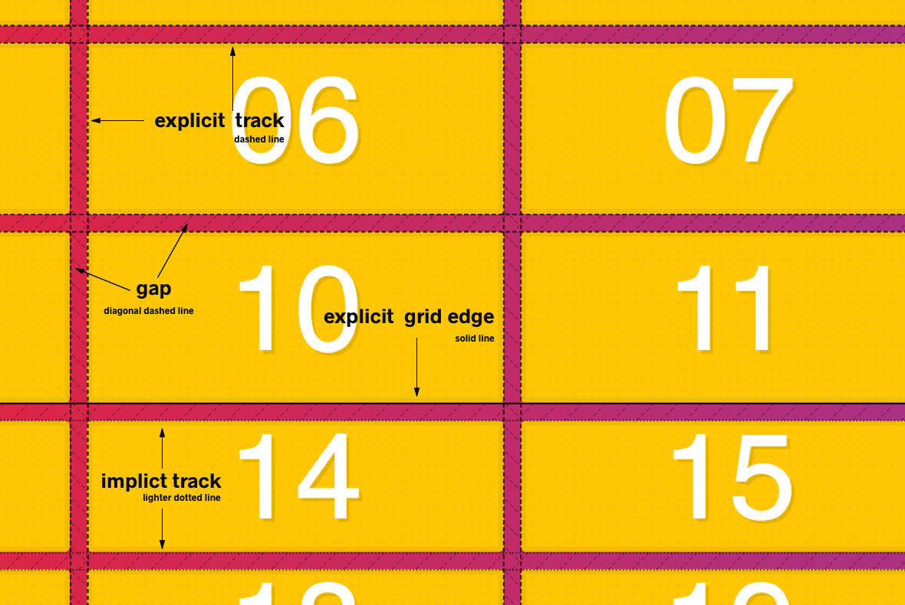

# LINKS


# FUNDAMENTALS

## Meanings



## Using in **CONTAINER**

- **Setting** 
  - The container with **grid**
  - Define number of **column** with **grid-template-columns**
  - Define number of **rows** with **grid-template-columns**
```css
.container{
  display: grid;
  grid-template-columns: 100px 100px 100px;
  grid-template-rows: 100px 100px 100px;
}
```

- **Grid-gap** specifying the **gutters** between grid rows and columns.
  - **shorthand** to
    - **grid-row-gap**
    - **grid-column-gap**
```css
.container{
  grid-gap: 10px 15px;
}
```


- **AutoFill**, create **implicit** columns
```css
.container{
  grid-template-columns: repeat(auto-fill, 120px);
}
```

- **AutoFit**, ont create implicit, dont have empty spots, **best to responsives**
```css
.container{
  grid-template-columns: repeat(auto-fit, 120px);
}
```


## Using in **ITEMS**
- **Size** items
```css
.item{
  grid-column: span 2;
  grid-row: span 2;
}
```

- **Placing** items
  - Define **start** item
  - Define **end** item
```css
.item{
  grid-column-start: 2;
  grid-column-end: 6;
  grid-row-start: 2;
  grid-row-end: 6;
  /* or */
  grid-column: 2 / 5;
  grid-row: 2 / 5;
}
```

## EXPLICIT

## IMPLICIT

- **Define**  automatically rows size
```css
.container{
  grid-auto-rows: 200px;
}
```
- **Define**  automatically columns size
```css
.container{
  grid-auto-columns: 200px;
}
```
- **Define**  automatically rows(default) or columns quantity 
```css
.container{
  grid-auto-flow: column;
}
```


## UNIT
- **FR** Fractional Unit, represent is for par of the available space
```css
.container{
    display: grid;
    grid-gap: 20px; 
    border: 10px solid var(--yellow);
    grid-template-columns: 1fr 2fr;
  }
```

## Alignment + Centering
- **AligItems** and **JustifyItems**
```css
.container{
  align-items: center;
  justify-items: center;
  /* or */
  place-items: center center;
}
```

- **AlignContent** and **JustifyContent**
```css
.container{
  align-content: center;
  justify-content: center;
}
```

- **AlignSelf** and **JustifySelf**
```css
.item{
  justify-self: center;
  align-self: center;
}
```

- **Align-*** and **Justify-***
```css
```

## FUNCTIONS
- **Repeat**
```css
.container{
  grid-template-columns: repeat(5, 100px);
}
```

- **MinMax**, use to responsive
```css
.container{
  grid-template-columns: repeat(auto-fit, minmax(100px, 1fr));
}
```

- **FitContent**, function clamps a given size to an available size according to the formula min(maximum size, max(minimum size, argument)).
```css
.container{
  grid-template-columns: fit-content(120px), 190px;
}
```


# OBSERVATIONS
- When use `display:grid` automatically your childrens are called **griditem**
- **Implicit** vs **Explicit**
 - If **you do not create** them they are called **implicit**
- In **placing** the value 100% are:
```css
grid-column: 1 / -1;
```